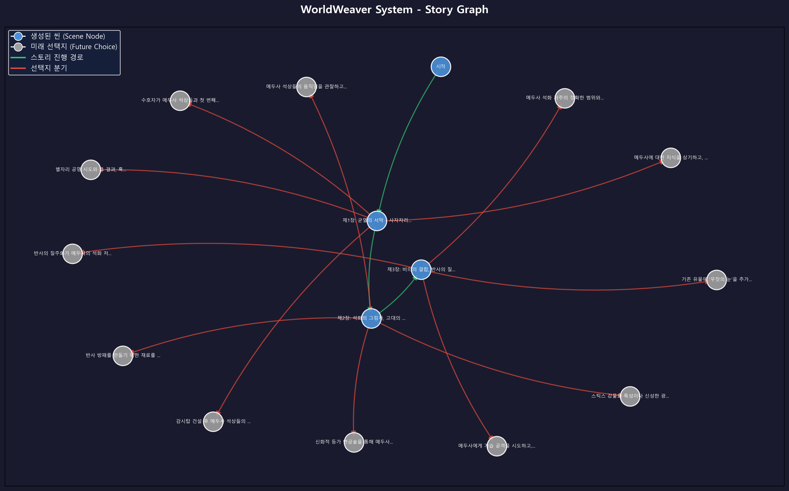

# WorldWeaver System

> 세계관 문서만 넣으면 AI가 게임을 만드는 범용 인터랙티브 스토리 생성 엔진

## 프로젝트 소개

WorldWeaver System은 **세계관 문서 폴더 하나만 제공하면**, AI가 자동으로 게임 시스템을 설계하고 실시간 텍스트형 게임을 구동하는 범용 스토리 생성 엔진입니다.

핵심 파이프라인:

```
세계관 문서 → 지식 그래프 추출 → 테마 JSON 자동 생성 → 인터랙티브 게임 구동
```

게임의 구조는 방향 그래프(Directed Graph)로 관리됩니다. AI가 생성하는 씬(Scene)은 노드로, 선택지는 엣지로 구성되며, 그래프 이력과 월드 스테이트를 조합한 **룰베이스 검증 엔진**이 세계관의 논리적 무결성을 보장합니다.



## 주요 기능

- **지식 그래프 기반 테마 빌더** — 세계관 문서를 청킹 → 지식 그래프 추출 → 병합 → 테마 JSON 자동 생성
- **범용 테마 시스템** — 코드 수정 없이 JSON만으로 완전히 다른 세계관의 게임 구동
- **동적 월드 스테이트** — 테마 스키마가 정의하는 게이지/엔티티/컬렉션을 매 씬마다 LLM이 업데이트
- **그래프 + 룰베이스 검증** — 그래프 이력과 월드 스테이트를 조합하여 모순 방지 (사전 지시 + 사후 검증)
- **RAG 누적 기억** — 생성된 스토리가 벡터 스토어에 누적되어 이전 사건을 기억하고 참조
- **구조화된 LLM 출력** — Pydantic 모델로 제목, 설명, 분위기, 선택지, 상태 변화를 정형 데이터로 변환

## 기술 스택

| 카테고리 | 기술 | 용도 |
|----------|------|------|
| LLM | Google Gemini 2.5-Flash | 스토리 생성, 지식 그래프 추출, 테마 설계 |
| LLM 프레임워크 | LangChain (LCEL) | 파이프라인 오케스트레이션 |
| 벡터 검색 | FAISS + GoogleGenerativeAIEmbeddings | RAG 세계관 검색 + 누적 기억 |
| 데이터 검증 | Pydantic | LLM 출력 스키마 검증 |
| 그래프 | NetworkX | 스토리 분기 관리 + 지식 그래프 |
| 설정 관리 | JSON 외부화 | 프롬프트/규칙/테마를 코드 분리 |

## 아키텍처

### 전체 시스템 흐름

```
[세계관 문서]
     │
     ▼
[Theme Builder] ─── 청킹 → 청크별 지식 그래프 추출 → 병합 → 테마 JSON 생성
     │
     ▼
[테마 JSON] ─── world_state_schema, rules, personas, initial_prompt
     │
     ▼
[Game Session]
     │
     ├── RuleEngine.pre_generation_directives()  ◄── WorldState + StoryGraph
     │        │
     │        ▼
     ├── LCEL Chain (RAG 컨텍스트 + 월드 스테이트 + 지시사항 → LLM → 씬 생성)
     │        │
     │        ▼
     ├── RuleEngine.validate_scene()  ── 위반 시 재생성 (최대 2회)
     │        │
     │        ▼
     ├── WorldState.apply_changes()  ── 상태 업데이트
     ├── StoryGraph.add_scene()      ── 그래프 기록
     └── LoreMemory.add_memory()     ── RAG 기억 누적
```

### 테마 빌더 파이프라인

```
[문서 로드 + 청킹]
     │
     ▼
[청크별 LLM 호출] → 부분 지식 그래프 추출 (노드: 캐릭터/장소/아이템/시스템/개념)
     │
     ▼
[그래프 병합] → 같은 이름의 노드가 청크 간 연결점 역할
     │
     ├── knowledge_graph.graphml 저장 (시각화 가능)
     │
     ▼
[병합된 그래프 → LLM] → 테마 JSON 생성
```

## 프로젝트 구조

```
WorldWeaver-System/
├── main.py                          # CLI 진입점 (build-theme / play)
├── worldweaver/                     # 핵심 엔진 패키지
│   ├── chain.py                     # LCEL 체인 조립
│   ├── config.py                    # 시스템 설정 (JSON에서 로드)
│   ├── game.py                      # GameSession (생성→검증→상태 업데이트 루프)
│   ├── graph.py                     # StoryGraph (NetworkX DiGraph + 이력 조회)
│   ├── models.py                    # Pydantic 데이터 모델
│   ├── persona.py                   # 페르소나 기반 선택 전략
│   ├── prompt_loader.py             # JSON 설정 로더 (캐싱)
│   ├── rag.py                       # LoreMemory (FAISS 벡터 스토어)
│   ├── rule_engine.py               # 그래프 + 월드 스테이트 룰베이스 검증
│   ├── theme_builder.py             # 지식 그래프 기반 테마 자동 생성
│   └── world_state.py               # 스키마 기반 동적 월드 스테이트
├── prompts/                         # 외부화된 프롬프트/설정 (코드 수정 없이 교체 가능)
│   ├── game_config.json             # LLM/RAG/게임 시스템 설정
│   ├── story_template.json          # 스토리 생성 프롬프트 템플릿
│   ├── rules.json                   # 공통 룰엔진 규칙
│   ├── theme_builder.json           # 테마 빌더 프롬프트
│   └── themes/
│       └── mythology.json           # 신화 테마 (예시)
├── lore_documents/                  # 세계관 문서
│   ├── worldbuilding.txt
│   └── core_systems.txt
├── docs/                            # 프로젝트 문서
├── visualize_graph.py               # 스토리 그래프 시각화
└── pyproject.toml
```

## 실행 방법

### 필수 조건

- Python 3.13 이상
- Google AI Studio API 키 ([발급 링크](https://aistudio.google.com/apikey))

### 설치

```bash
git clone <repository-url>
cd WorldWeaver-System

python -m venv .venv
source .venv/bin/activate  # Windows: .venv\Scripts\activate

pip install -e .
```

### 환경 설정

```
# .env
GOOGLE_API_KEY=your_api_key_here
```

### 테마 자동 생성

세계관 문서 폴더만 준비하면 테마 JSON이 자동 생성됩니다:

```bash
python main.py build-theme --lore-dir lore_documents
```

### 게임 실행

```bash
# 인터랙티브 모드 (직접 플레이)
python main.py play --theme mythology

# 자동 데모 모드
python main.py play --theme mythology --mode auto --persona hero --scenes 10
```

## 실행 예시

```
테마 로드: 신화 테마 - 별자리의 수호자
세계관 정보를 로드하여 RAG 메모리 구축 ....
RAG 구축 완료

========================================================
장면 생성 중 ....

[ 제1장: 균열의 서막 ]
밤하늘의 사자자리(Leo)는 언제나 굳건한 빛을 발하며 별의 제단을 비추는
이정표였습니다. 하지만 오늘 밤, 그 웅장했던 빛이 미세하게 떨리더니 이내
눈에 띄게 약해지기 시작했습니다...

(시스템: 새로운 기억이 저장되었음)
(시스템: 월드 스테이트 업데이트됨)
  활성 균열: 그리스 신화 | 타락 게이지: 0.1 | 봉인 게이지: 0.0
  캐릭터: 메두사(적대)
  아이템: 수호자의 검

--- 선택지 ---
1. 신성한 광맥에 감시탑을 건설하여 방어선을 구축한다.
2. 별자리의 힘을 끌어와 광맥의 에너지를 증폭시킨다.
3. 고대 기록을 되짚어 메두사의 약점을 떠올린다.
4. 수호자의 무기를 들고 전방으로 나선다.
```

## 새로운 테마 만들기

코드 수정 없이 세계관 문서만 준비하면 됩니다:

```bash
# 1. 세계관 문서 폴더 준비
mkdir lore_scifi
# worldbuilding.txt, systems.txt 등 작성

# 2. 테마 자동 생성
python main.py build-theme --lore-dir lore_scifi --theme-name scifi

# 3. 생성된 테마로 플레이
python main.py play --theme scifi
```
