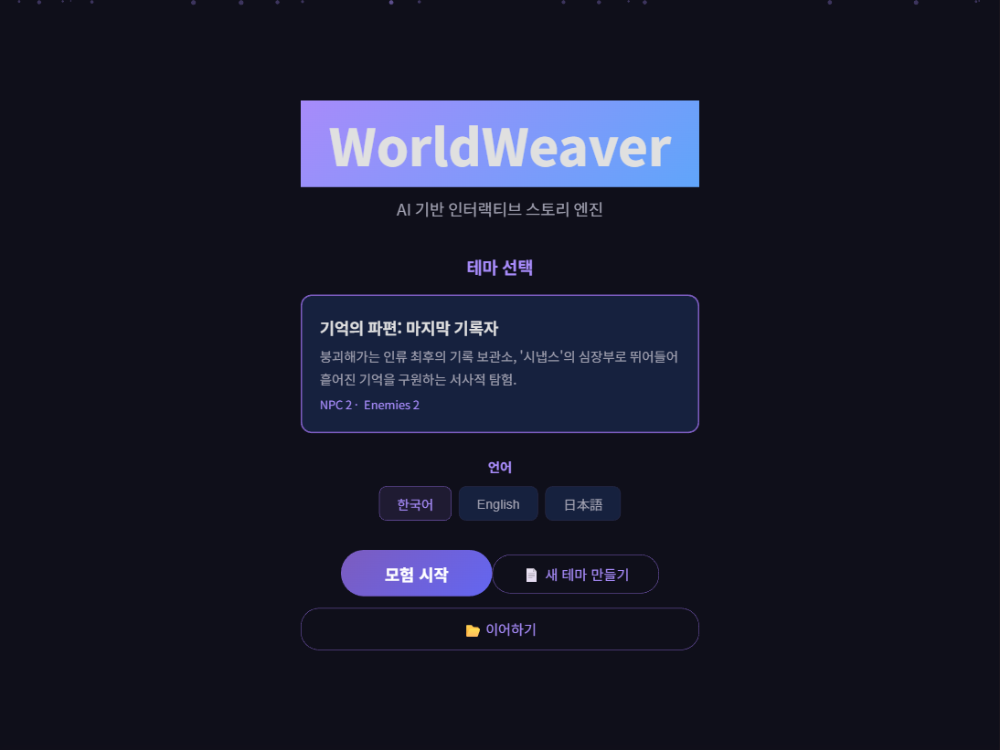
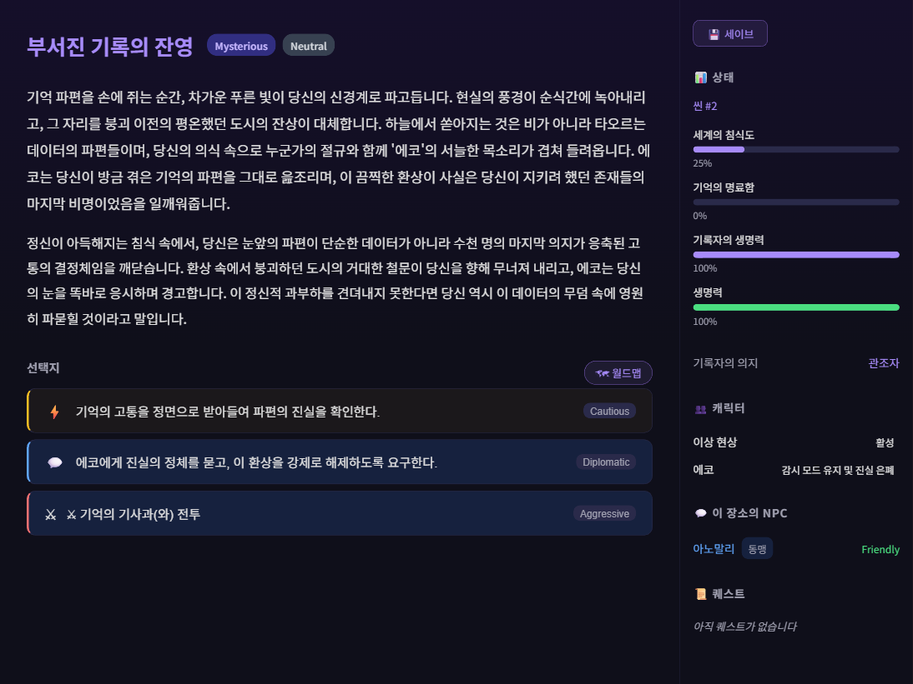
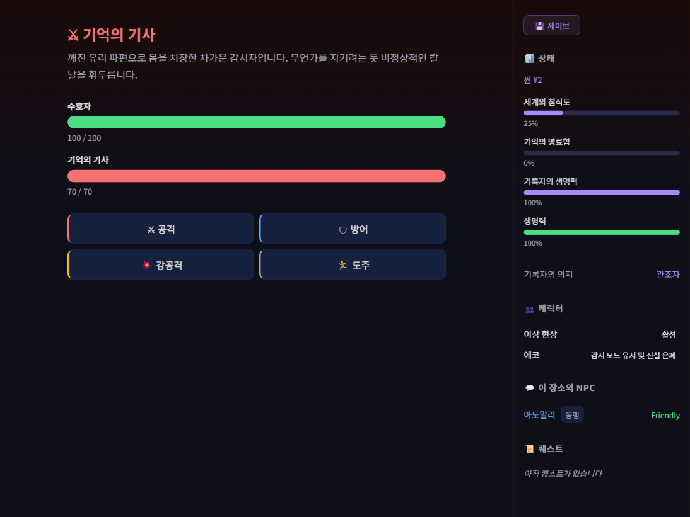
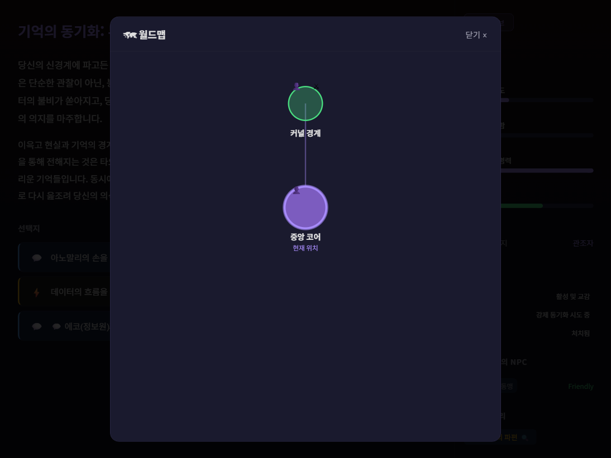
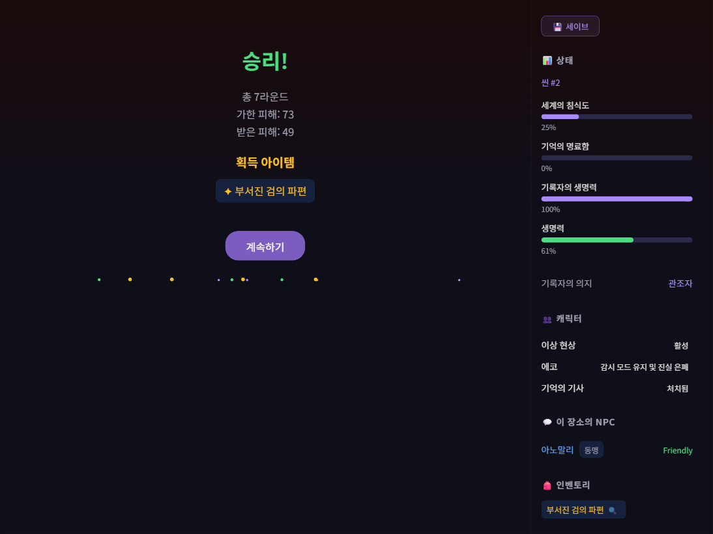

# WorldWeaver

[](https://python.org)
[](https://nodejs.org)
[](https://react.dev)
[](https://fastapi.tiangolo.com)
[](https://langchain.com)
[](LICENSE)
[](mailto:rlaghks1103@gmail.com)

> **[Demo](https://worldweaver-demo-production.up.railway.app)** | AI駆動インタラクティブストーリーエンジン — 世界観ドキュメントを入れるだけでWebブラウザで楽しめるテキストアドベンチャー
>
> [한국어](README.md) | [English](README_EN.md) | **日本語**

<p align="center">
  
</p>

## なぜ作ったのか

テキストアドベンチャーゲームは豊かな物語を伝えることができますが、従来の方式には3つの根本的な限界があります。

| 問題 | 説明 |
|------|------|
| **世界観ごとにコードを書き直す必要がある** | 新しい背景を作るたびに、スクリプト、分岐、NPCを手作業で実装しなければなりません。世界観ドキュメントがあっても、それをゲームに変えるには膨大な開発コストがかかります。 |
| **固定された分岐では没入感に限界がある** | 事前に作成された選択肢のみを提供すると、プレイヤーはすぐにパターンを把握し、没入感が損なわれます。毎回新しい展開と多様な分岐が自動生成されてこそ、真のリプレイ価値が生まれます。 |
| **LLMの自由生成だけではゲームにならない** | LLMにストーリーを任せると、世界観に合わない内容を生成（ハルシネーション）したり、非定型テキストを出力してゲームシステムと連携できなくなります。 |

**WorldWeaverはこの3つを同時に解決します。**

- 世界観ドキュメントフォルダを入れるだけで**知識グラフ抽出 → テーマJSON自動生成**により、コード修正なしで新しいゲームが作られ、
- LLMが毎シーンごとに**世界観に合った多様な分岐を自動生成**し、プレイするたびに異なる展開を体験でき、
- **知識グラフ + ルールエンジン + RAG + Pydanticスキーマ**でLLM出力の一貫性と定型性を構造的に保証します。

```
世界観ドキュメント → 知識グラフ抽出 → テーマJSON自動生成 → Webブラウザでプレイ
```

## 主要機能

### ゲームシステム

| 機能 | 説明 |
|------|------|
| **ストーリー生成** | LLMが毎シーンごとに新しい物語を生成し、タイピングアニメーションで表示 |
| **多様な選択肢** | 通常(▸)、会話(💬)、戦闘(⚔)、危険(⚡)など種類別選択肢 |
| **ターン制戦闘** | CombatViewで攻撃/防御/強攻撃/アイテム/逃走アクション、HPバーリアルタイム表示 |
| **NPC会話** | DialogueViewでNPCと自由会話、好感度システム、クエスト/アイテム付与 |
| **ワールドマップ** | ステージ間移動、解放条件(アイテム/ゲージ)、現在位置アニメーション |
| **インベントリ** | 戦闘戦利品管理、アイテム調査(🔍)で隠し効果発見 |
| **クエストシステム** | 時間経過による劣化(active→fading→lost)、NPC会話で復元 |
| **称号システム** | 条件達成時に称号獲得 + ボーナス効果 |
| **セーブ/ロード** | JSONファイルで全ゲーム状態を保存/復元(グラフデータ含む) |
| **多言語** | 韓国語 / English / 日本語 UI対応 |
| **エンディング/ゲームオーバー** | 条件付きエンディングトリガー、敗北時ゲームオーバー画面 + セーブ復元 |

### エンジンコア

- **知識グラフベースのテーマビルダー** — 世界観ドキュメントをチャンキング → 知識グラフ抽出 → マージ → テーマJSON + NPCプロファイル自動生成
- **汎用テーマシステム** — コード修正なしでJSONのみで完全に異なる世界観を駆動
- **NPCメモリグラフ** — NPC別独立有向グラフ、ステージ別に隔離された記憶
- **グラフ + ルールベース検証** — ストーリーグラフ履歴とワールドステートを組み合わせた整合性検証
- **RAG累積記憶** — 生成されたストーリーがベクトルストアに蓄積、過去の事件を参照
- **動的ワールドステート** — ゲージ/エンティティ/コレクションを毎シーンごとにLLMが更新
- **構造化されたLLM出力** — Pydanticモデルで定型データに変換

### ゲーム画面

| ストーリー進行 + サイドバー | 戦闘システム |
|:---:|:---:|
|  |  |

| ワールドマップ | 戦闘勝利 |
|:---:|:---:|
|  |  |

## 技術スタック

| カテゴリ | 技術 | 用途 |
|----------|------|------|
| **LLM** | Google Gemini 2.5-Flash | ストーリー/会話/知識グラフ生成 |
| **LLMフレームワーク** | LangChain (LCEL) | パイプラインオーケストレーション |
| **ベクトル検索** | FAISS + GoogleGenerativeAIEmbeddings | RAG世界観検索 + 累積記憶 |
| **バックエンド** | FastAPI + Uvicorn | REST API + WebSocket |
| **フロントエンド** | React 19 + TypeScript 5.9 + Vite 8 | SPAウェブクライアント |
| **UIアニメーション** | Framer Motion | タイピングエフェクト、トランジションアニメーション |
| **マークダウンレンダリング** | react-markdown | ストーリーテキストフォーマット |
| **データ検証** | Pydantic v2 | LLM出力スキーマ検証 |
| **グラフ** | NetworkX | ストーリー分岐 + 知識グラフ + NPCメモリ |

## アーキテクチャ

```
┌──────────────────────────────────────────────────────────────┐
│  Frontend (React + TypeScript)                               │
│  ┌──────────┐ ┌──────────┐ ┌──────────┐ ┌────────────────┐  │
│  │TitleScreen│ │StoryView │ │CombatView│ │  DialogueView  │  │
│  └──────────┘ └──────────┘ └──────────┘ └────────────────┘  │
│  ┌──────────┐ ┌──────────┐ ┌──────────┐ ┌────────────────┐  │
│  │ WorldMap  │ │ Sidebar  │ │EndingView│ │ GameOverView   │  │
│  └──────────┘ └──────────┘ └──────────┘ └────────────────┘  │
└────────────────────────┬─────────────────────────────────────┘
                         │ REST API
┌────────────────────────▼─────────────────────────────────────┐
│  Backend (FastAPI)                                            │
│  ┌──────────────────┐  ┌──────────────────────────────────┐  │
│  │  SessionManager   │  │  WebGameSession                  │  │
│  │  (マルチセッション管理) │  │  ├─ StoryChain (LCEL)            │  │
│  └──────────────────┘  │  ├─ NPCDialogueChain             │  │
│                        │  ├─ CombatEngine                  │  │
│                        │  ├─ WorldState                    │  │
│                        │  ├─ StoryGraph (NetworkX)         │  │
│                        │  ├─ RuleEngine                    │  │
│                        │  ├─ NPCManager + MemoryGraph      │  │
│                        │  ├─ ItemGraph                     │  │
│                        │  └─ LoreMemory (FAISS RAG)        │  │
│                        └──────────────────────────────────┘  │
└──────────────────────────────────────────────────────────────┘
         │                          │
    ┌────▼────┐              ┌──────▼──────┐
    │ Gemini  │              │  FAISSベクトル │
    │  API    │              │   ストア     │
    └─────────┘              └─────────────┘
```

## プロジェクト構成

```
WorldWeaver-System/
├── run_server.py                     # バックエンドサーバー実行
├── main.py                           # CLIエントリーポイント (build-theme / play)
│
├── worldweaver/                      # コアエンジンパッケージ
│   ├── chain.py                      # LCELチェーン (ストーリー + NPC会話)
│   ├── combat.py                     # ターン制戦闘エンジン
│   ├── config.py                     # システム設定
│   ├── content_filter.py             # 入力フィルター + トピック検証
│   ├── ending.py                     # エンディング/ゲームオーバーロジック
│   ├── game.py                       # GameSession (CLIモード)
│   ├── graph.py                      # StoryGraph (NetworkX)
│   ├── item_graph.py                 # アイテムグラフ + 隠し効果
│   ├── judgment.py                   # 危険選択肢判定
│   ├── llm_factory.py                # LLMプロバイダーファクトリー
│   ├── models.py                     # Pydanticデータモデル
│   ├── npc_memory.py                 # NPCメモリグラフ
│   ├── persona.py                    # ペルソナ選択戦略
│   ├── prompt_loader.py              # プロンプトJSONローダー
│   ├── rag.py                        # LoreMemory (FAISS)
│   ├── rule_engine.py                # ルールベース検証エンジン
│   ├── save_load.py                  # セーブ/ロードシリアライズ
│   ├── theme_builder.py              # 知識グラフベースのテーマ自動生成
│   ├── translate.py                  # 多言語翻訳システム
│   ├── world_state.py                # 動的ワールドステート
│   └── api/
│       ├── server.py                 # FastAPIサーバー (REST + WebSocket)
│       └── session_manager.py        # ウェブゲームセッション管理
│
├── frontend/                         # ウェブフロントエンド
│   ├── src/
│   │   ├── App.tsx                   # メインアプリ (ビュールーティング + 状態管理)
│   │   ├── i18n.ts                   # 多言語翻訳 (韓/英/日)
│   │   ├── api/client.ts             # APIクライアント
│   │   └── components/
│   │       ├── TitleScreen.tsx        # タイトル画面
│   │       ├── ThemeBuilder.tsx       # 世界観ドキュメント → テーマ生成UI
│   │       ├── StoryView.tsx          # ストーリービュー (シーン + 選択肢)
│   │       ├── CombatView.tsx         # 戦闘ビュー
│   │       ├── DialogueView.tsx       # NPC会話ビュー
│   │       ├── WorldMap.tsx           # ワールドマップオーバーレイ
│   │       ├── Sidebar.tsx            # サイドバー (状態/インベントリ/クエスト)
│   │       ├── EndingView.tsx         # エンディング画面
│   │       ├── GameOverView.tsx       # ゲームオーバー画面
│   │       ├── TypewriterText.tsx     # タイピングアニメーション
│   │       └── MarkdownText.tsx       # マークダウンレンダリング
│   └── package.json
│
├── prompts/                          # 外部化されたプロンプト/設定
│   ├── game_config.json              # システム設定
│   ├── story_template.json           # ストーリー生成プロンプト
│   ├── npc_dialogue.json             # NPC会話プロンプト
│   ├── ending_template.json          # エンディング生成プロンプト
│   ├── rules.json                    # ルールエンジン規則
│   ├── theme_builder.json            # テーマビルダープロンプト
│   └── themes/                       # テーマJSONファイル
│       └── synapse_collapse.json
│
├── lore_documents/                   # 世界観ドキュメント
│   ├── synapse_collapse/             # テーマ別原本ドキュメント
│   ├── synapse_reckoning/
│   └── knowledge_graph.graphml       # 抽出された知識グラフ
│
├── docs/                             # プロジェクトドキュメント
└── pyproject.toml
```

## 実行方法

### 必須条件

- Python 3.12+
- Node.js 18+
- Google AI Studio APIキー ([発行リンク](https://aistudio.google.com/apikey))

### インストール

```bash
git clone <repository-url>
cd WorldWeaver-System

# バックエンドインストール
python -m venv .venv
source .venv/bin/activate  # Windows: .venv\Scripts\activate
pip install -e .

# フロントエンドインストール
cd frontend
npm install
cd ..
```

### 環境設定

```bash
# .envファイル作成
echo "GOOGLE_API_KEY=your_api_key_here" > .env
```

### ウェブゲーム実行

```bash
# 1. バックエンドサーバー実行 (ポート8000)
python run_server.py

# 2. フロントエンド開発サーバー実行 (新しいターミナル、ポート5173)
cd frontend
npm run dev
```

ブラウザで **http://localhost:5173** にアクセスしてゲームをお楽しみください。

### CLIモード実行

```bash
# インタラクティブモード (ターミナルで直接プレイ)
python main.py play --theme mythology

# 自動デモモード
python main.py play --theme mythology --mode auto --persona hero --scenes 10
```

### テーマ自動生成

世界観ドキュメントフォルダを用意するだけでテーマJSONが自動生成されます：

```bash
# 1. 世界観ドキュメントフォルダ準備
mkdir lore_scifi
# worldbuilding.txt, systems.txt などを作成

# 2. テーマ自動生成
python main.py build-theme --lore-dir lore_scifi --theme-name scifi

# 3. 生成されたテーマでプレイ
python main.py play --theme scifi
```

ウェブUIの**「新しいテーマを作成」**ボタンからも世界観ドキュメントをアップロードしてテーマを生成できます。

## ゲームプレイガイド

### 基本フロー

1. **タイトル画面** — テーマ選択、言語選択、冒険開始
2. **プロローグ** — AIが生成した世界観イントロ
3. **ストーリー進行** — シーンを読む → 選択肢を選ぶ → 次のシーン生成の繰り返し
4. **エンディング** — 条件達成時にエンディングトリガー

### 選択肢の種類

| アイコン | 種類 | 説明 |
|--------|------|------|
| ▸ | 通常 | ストーリー進行 |
| 💬 | 会話 | NPCとの会話モード突入 |
| ⚔ | 戦闘 | ターン制戦闘モード突入 |
| ⚡ | 危険 | 判定が適用されるハイリスク・ハイリターン選択肢 |

### 戦闘システム

| アクション | 効果 |
|------|------|
| ⚔ 攻撃 | 基本攻撃 |
| 🛡 防御 | 防御力1.5倍、ダメージ軽減 |
| 💥 強攻撃 | 2倍ダメージ、代わりに防御脆弱 |
| 🎒 アイテム | インベントリアイテム使用 |
| 🌟 逃走 | 戦闘離脱を試みる |

### サイドバー

右側サイドバーでリアルタイムのゲーム状態を確認できます：

- **ゲージバー** — 体力/汚染/封印などリアルタイム表示
- **キャラクター** — 倒した敵、NPC好感度
- **NPCリスト** — 現在地のNPCと性向
- **インベントリ** — 所持アイテム + 🔍 調査機能
- **クエスト** — アクティブ(🟢)/退色(🟡)/消失(🔴)/完了(✅)
- **セーブ** — JSONファイルダウンロード

## 内部アーキテクチャ詳細

### テーマビルダーパイプライン

```
[世界観ドキュメント]
     │
     ▼
[ドキュメントチャンキング] → チャンク別LLM呼び出し → 部分知識グラフ抽出
     │
     ▼
[グラフマージ] → 同名ノードがチャンク間の接続点
     │
     ├── knowledge_graph.graphml (視覚化可能)
     ▼
[マージグラフ → LLM] → テーマJSON生成
     │
     ├── NPC候補自動選出 (2〜5名)
     ├── ステージ別NPC配置
     └── トリガー条件自動設計
```

### ゲームセッションフロー

```
[選択肢クリック]
     │
     ├── 通常 → RuleEngine.pre_generation → LCEL Chain → RuleEngine.validate
     │         → WorldState.apply → StoryGraph.add → LoreMemory.add
     │
     ├── 戦闘 → CombatEngine.start → ターンループ → 結果反映
     │
     ├── 会話 → NPCDialogueChain → 好感度/行動処理 → WorldState同期
     │
     └── 危険 → JudgmentEngine.roll → 有利/不利が反映されたシーン生成
```

## ライセンス

MIT License
